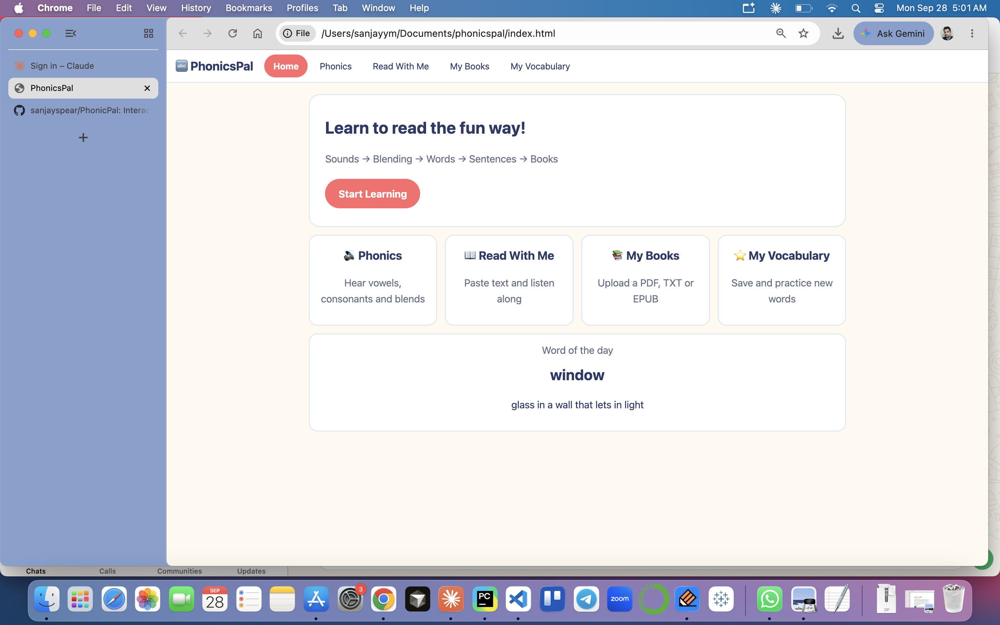
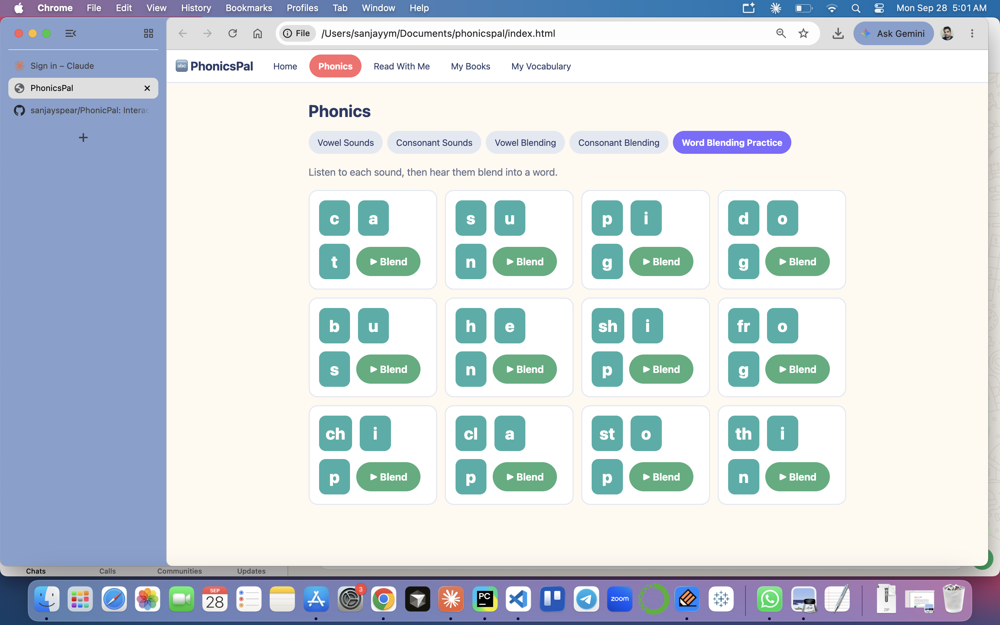
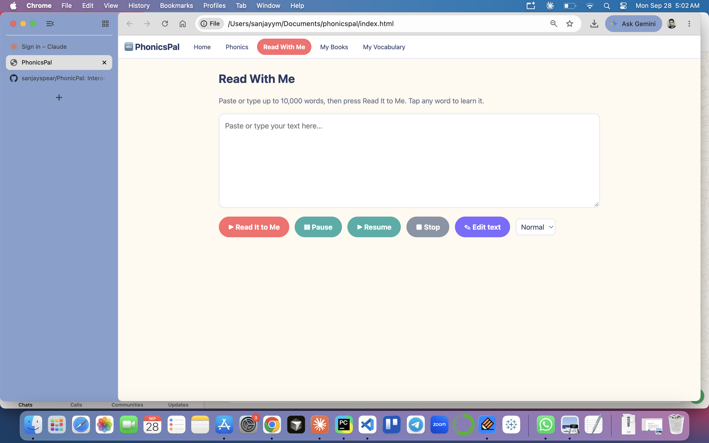
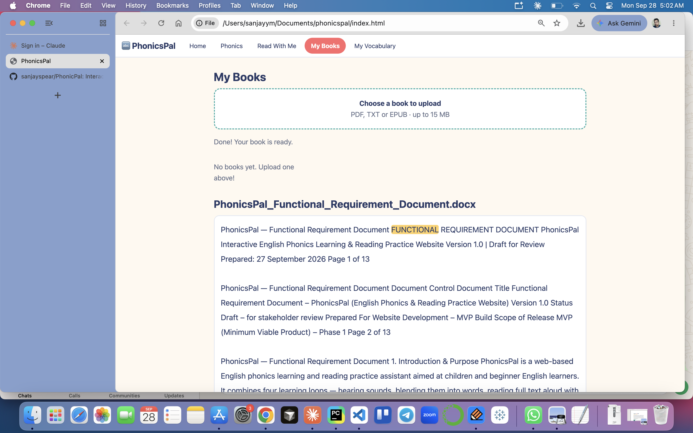
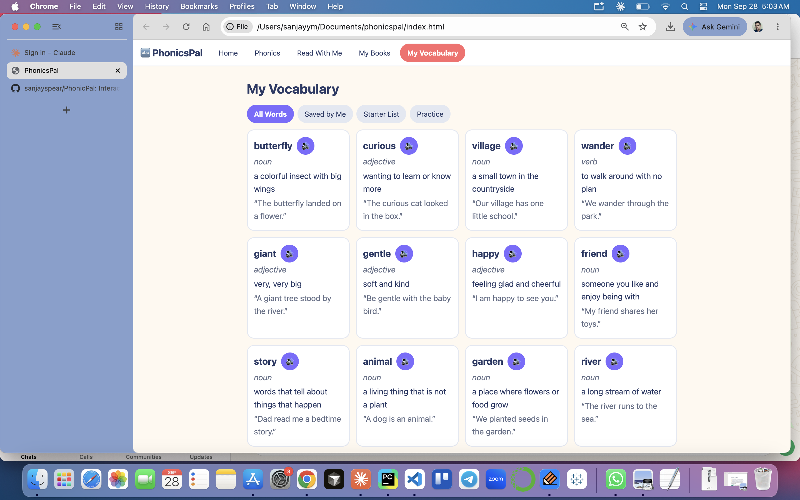

# PhonicsPal

Interactive English phonics and reading practice website (MVP). Plain HTML/CSS/JS, no build step.

## Run locally
- VS Code: install the **Live Server** extension, right-click `index.html` > *Open with Live Server*, or
- Terminal: `npm start` (serves the folder on http://localhost:3000).

Use Chrome or Edge for the best text-to-speech and word highlighting. Internet is needed to load PDF.js and JSZip from the cdnjs CDN.

## Screens

PhonicsPal is organized around five learning screens, accessible from the top navigation.

### Home

The home screen introduces the learning path, from sounds and blending through words, sentences, and books. Shortcuts open the phonics, reading, book-library, and vocabulary activities. A word-of-the-day panel adds a quick vocabulary prompt.

### Phonics

The phonics screen groups activities into vowel sounds, consonant sounds, vowel blending, consonant blending, and word-blending practice. Learners can listen to individual sounds and use the blend controls to hear them combined.

### Read With Me

Learners can paste or enter text to hear it read aloud, with controls to pause, resume, stop, edit the text, and choose a reading voice. Selecting a word supports vocabulary lookup while reading.

### My Books

The book library accepts PDF, TXT, and EPUB files up to 15 MB. Uploaded books can be opened for reading aloud, and library items can be deleted. Supported documents are shown in the reading area.

### My Vocabulary

Vocabulary is organized into All Words, Saved by Me, Starter List, and Practice views. Word entries include a part of speech, definition, example sentence, and a listen control; the practice view supports review.

## Current Look and Feel

The interface uses a warm off-white page background with white content panels, dark navy headings, and rounded, lightly outlined surfaces. Coral highlights the active main-navigation item and primary actions; teal, green, and violet distinguish activity controls and secondary actions. The layout favors clear labels, generous spacing, and compact word and sound tiles, keeping the experience approachable while making each learning activity easy to scan.

## Structure
| File | Purpose |
|---|---|
| `index.html` | Page markup and script loading order |
| `css/styles.css` | Theme (light/dark), layout, components |
| `js/core.js` | Helpers, localStorage wrapper, `sp()` speech helper, navigation |
| `js/dictionary.js` | Starter dictionary (37 words), word lookup panel, save word |
| `js/reader.js` | Reader: text-to-speech, word highlight, pause/resume/stop, paging |
| `js/phonics.js` | Vowel/consonant/blend data and phonics screens |
| `js/books.js` | Upload (PDF/TXT/EPUB, 15 MB), text extraction, IndexedDB library |
| `js/vocabulary.js` | My Vocabulary list and practice quiz |
| `js/home.js` | Home page word of the day, initial route |

Scripts are classic (non-module) and share globals, so **load order in `index.html` matters**.

## Ideas for next steps
- Larger dictionary (bundled JSON word list, or a dictionary API called from a backend)
- Move to ES modules or Vite/React, and wrap speech in a `SpeechService` so a cloud voice can be swapped in
- Recorded phoneme audio clips, OCR for scanned PDFs, user accounts and sync
